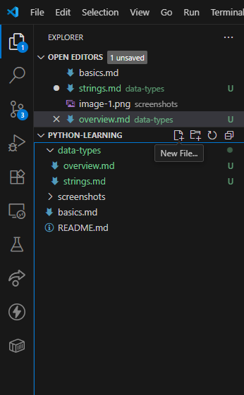
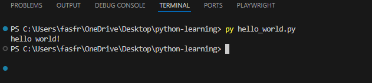

# Strings

A string is a way to represent text in your program. A string is written in Python by using either single or double quotes.
For example:
```
"Hello World"
'Hello World'
```

Lets practice creating a string by writing our first program. Inside VsCode, create a new file by either going to file -> new file. You can also click on the new file button near where it shows your folder name on the left.

Name the file `hello_world.py`. Make sure not to include any spaces in the name of the file. Adding spaces in a file name may lead to issues with the program not being found when trying to run the program.

Inside the program, add the following code
```
print("Hello World!")
```
`print()` is a function in Python. Whatever you put inside the parentheses will be shown (printed) in the terminal. So here, we are telling Python to print "Hello World!" to the terminal.

The terminal can be found at the bottom of VsCode. If you do not see it, try hitting ctrl + j to open it. You can also click on terminal from the top bar and select terminal -> new terminal.

To run the program, type `py hello_world.py`. Py is the interpreter Python and helloWorld.py is the name of the file we want to run the script for. If this doesn't work, you may need to use python or python3 instead of py.


### Practice
What happens with each of the following lines of code.
Test out each of the following lines of code one at a time. Before running each line, make a prediction on what you think will happen. What will it output? Will it work? Then test it out and write down what actually happened.
```
print('Hello World!')
print()'Hello World'
print(Hello World)
```